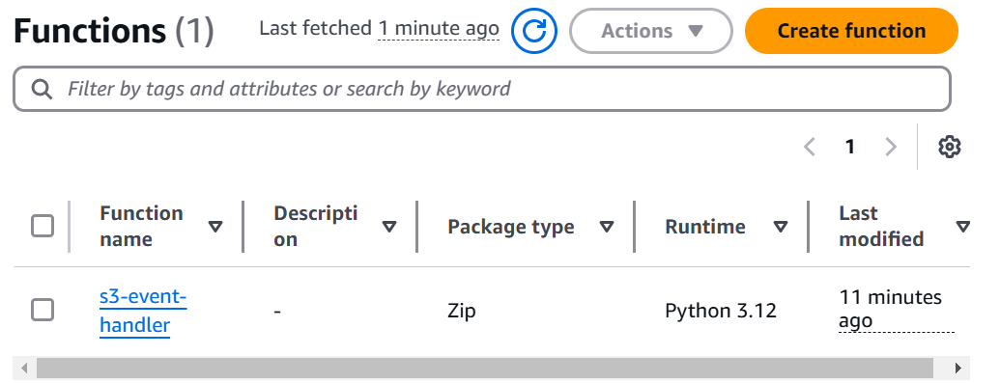

# Serverless App using with Terraform, Lambda & S3 and api gateway

**Project Overview**

This project creates a simple serverless API on AWS using Terraform. The API accepts an image upload, resizes it using Python (Pillow), and stores it in an S3 bucket.

## Stack

- **AWS Lambda** – Executes the image resizing logic
- **API Gateway (HTTP API)** – Receives image POST requests
- **S3** – Stores resized images
- **Terraform** – Manages the infrastructure as code
- **Python (Pillow)** – Handles image resizing inside Lambda

## Project Structure
├── lambda/
│ ├── lambda_function.py
│ └── Pillow package
├── terraform/
│ ├── main.tf
│ ├── outputs.tf
│ ├── providers.tf
│ ├── variables.tf
│ ├── terraform.tfvars # Ignored in git
│ └── .gitignore


## ⚙️ How It Works

1. User sends a base64 image in a POST request to `/upload` via API Gateway.
2. API Gateway triggers a Lambda function.
3. Lambda:
   - Resizes the image to 300x300 using Pillow
   - Stores it in `resized/` folder of the S3 bucket
4. Lambda returns a JSON with the image path.

## 🔧 Setup

### 1. Configure AWS Credentials
Make sure you have AWS CLI configured:
```bash
aws configure

**Terraform:**

Terraform is an open-source Infrastructure as Code (IaC) tool used to automate and manage cloud infrastructure. It allows you to define infrastructure resources (like servers, databases, and networks) in declarative configuration files and then provision them consistently across different environments.

**Prerequisites**
- AWS account
- IAM user with administrator or neccessary role enabled
- Terraform [Install terraform](https://developer.hashicorp.com/terraform/install)
- AWSCLI [Install awscli](https://docs.aws.amazon.com/cli/latest/userguide/getting-started-install.html)

**Stey by step guide**

- Configure your AWS credentials so that the AWS CLI can authenticate and interact with your AWS account

```
aws configure
```

- Create a parent directory

```
mkdir s3-lambda-event-handler
cd s3-lambda-event-handler
```

- create your code file 

```
touch lambda-function.py
```
 defines the function logic. The function is triggered by the Lambda service when an object is uploaded to the test-stage/ folder in the S3 bucket, which essentially moves object to the prod-stage/ and deletes it from test-stage/ aferwards. 

- create .gitignore file, to prevent making some sensitive files public like .tfvars file

- Create a terraform directory for your configurations

```
mkdir terraform
cd terraform
```

- Create configuration files 

`providers.tf` _contains all the providers needed for this project_

`variables.tf` _defines input variables_

`main.tf` _contains;_ 
- _module s3 bucket: creates a s3 bucket, modules makes simpler and more concise code._

- _resources aws_s3_object: folders cannot be directly created as resources in an S3 bucket. However, this can be achieved by defining an object with a key that ends with a /, which mimics the behavior of a folder._

- _module lambda: creates a lambda function and serves as entry point for the lamda-function.py,  a policy that grnats access to the s3 bucket is added._

- _resources aws_s3_bucket_notification, aws_lambda_permission: this allows s3 bucket to notify lambda of the event change and grants permission to trigger the fucntion_

`outputs.tf` _define output values that are displayed after the deployment completes_

`terraform.tfvars` _file is used to assign values to the input variables defined in `variables.tf`. It often contains sensitive information, such as AWS credentials or configuration settings. To protect this data, it is recommended to include the file in .gitignore to prevent accidental exposure in public repositories._

- Run the terraform command

`terraform init` _initializes the repository, adding all the dependencies required._

`terraform plan` _plan the changes to be added or removed, essentially a preview of what `terraform apply` will do, allowing you to review and confirm_ 


`terraform apply --auto-approve` _apply without prompt_

- Confirm the code is running perfectly 

_aws console - confirm the creation of bucket and lambda function_



_upload files to the test-stage/_


_confirm it in the prod-stage/_


**Conclusion**

This project demonstrates how to efficiently integrate AWS S3 and Lambda using Terraform to automate object management workflows. By creating a serverless solution, files uploaded to a specific folder are seamlessly processed and moved to a designated location, reducing manual intervention and improving operational efficiency. This project showcases the power of Infrastructure as Code (IaC) in automating cloud resource provisioning and management.


